# opengl-tutorial
基于PyOpenGL实现的Python opengl教程  
http://www.opengl-tutorial.org/cn/ 提供了非常详细的OpenGL教程，原有的代码为[C实现的版本](https://github.com/opengl-tutorials/ogl ),这里专注于将同样的内容使用Python重做。

[You can find English Version here!<<](README.md)  

为方便你更好的理解代码，在这里找到原教程内容。 http://www.opengl-tutorial.org/cn/  

## table of content  

0.  tu_00_glfw_window_sample : GLFW Version Colored cube.  
使用GLFW实现的基本绘制样例，演示GLFW的基本流程，以便于比较阅读C版本内容和Python版本内容。  
orginal tutorial => http://www.opengl-tutorial.org/cn/beginners-tutorials/tutorial-4-a-colored-cube/   
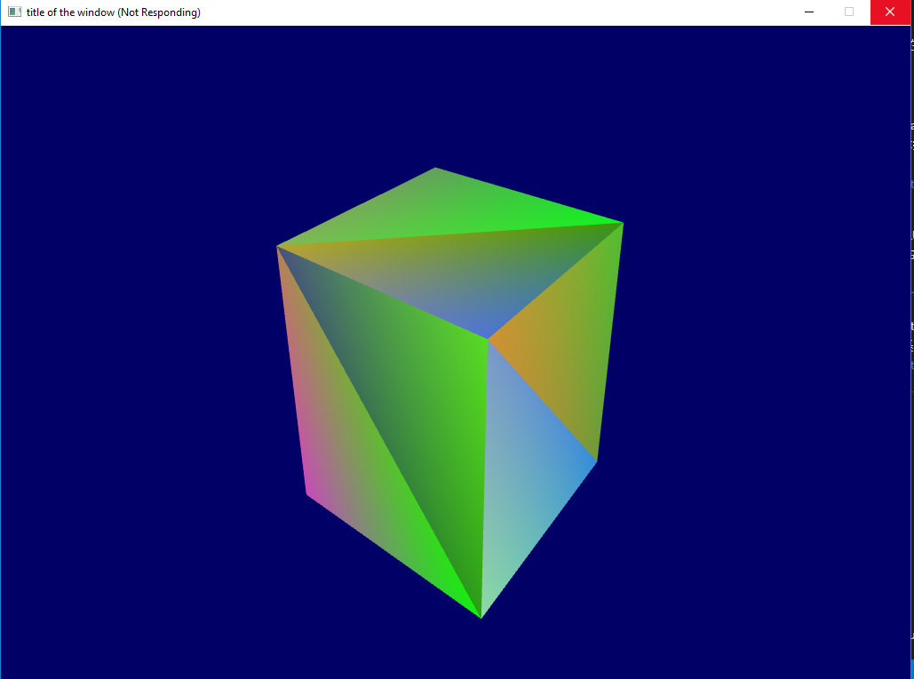

1.  tu_01_color_cube : GLUT Version Colored cube.  
GLUT 是另一个OpenGL的窗口工具，后续的所有代码都基于GLUT实现，这里给出与上节同样的功能是实现，以演示其基本流程。
orginal tutorial => http://www.opengl-tutorial.org/cn/beginners-tutorials/tutorial-4-a-colored-cube/  
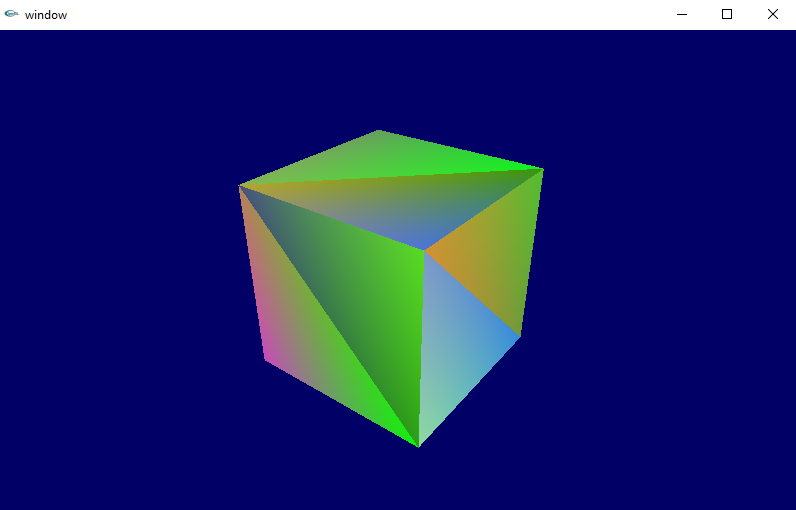

2.  tu_02_texture_without_normal: basic rendering with texture.  
通过PyOpenGL实现基本的定点和纹理绘制。   
orginal tutorial => http://www.opengl-tutorial.org/cn/beginners-tutorials/tutorial-5-a-textured-cube/  
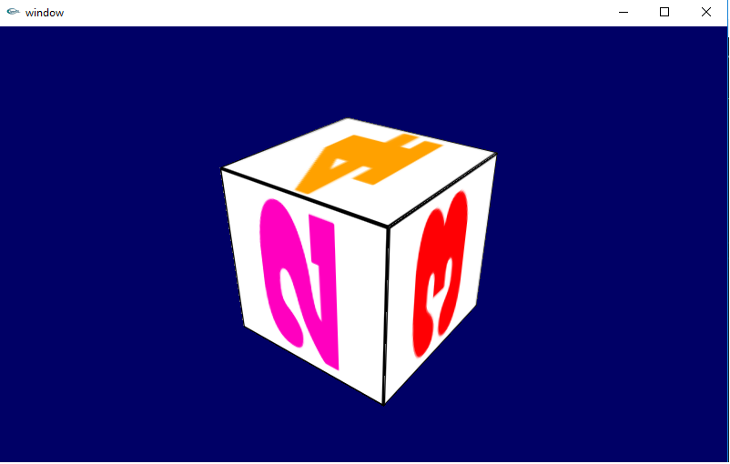

3. tu_03_loadobj : load mesh information from wavefont obj file:  
演示如何从Obj文件加载Mesh定点和UV坐标。  
orginal tutorial => http://www.opengl-tutorial.org/cn/beginners-tutorials/tutorial-7-model-loading/  
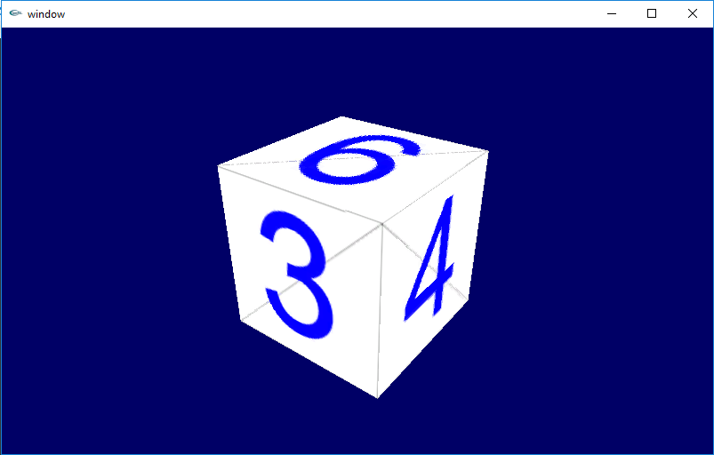

4. tu_04_vbo : use VBO   
使用VBO绘制Mesh  
orginal tutorial => http://www.opengl-tutorial.org/cn/intermediate-tutorials/tutorial-9-vbo-indexing/    
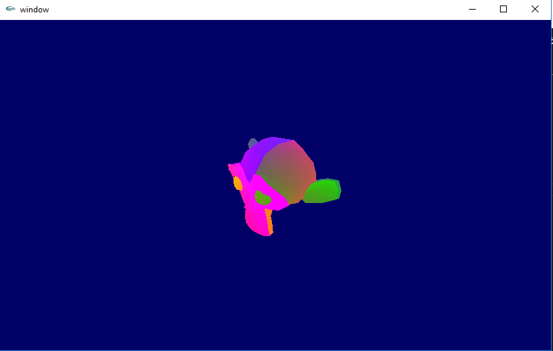

5. tu_05_input : add viewport control with keyboard and mouse  
为查看工具添加键盘和鼠标支持
orginal tutorial => http://www.opengl-tutorial.org/cn/beginners-tutorials/tutorial-6-keyboard-and-mouse/    
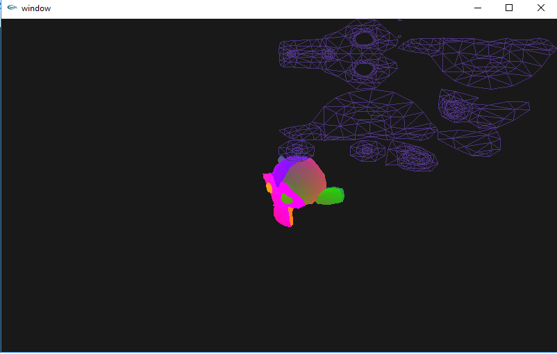  

6. tu_06_multobjs: draw multi mesh objects in same window  
在同一个窗口内绘制多个mesh对象。   
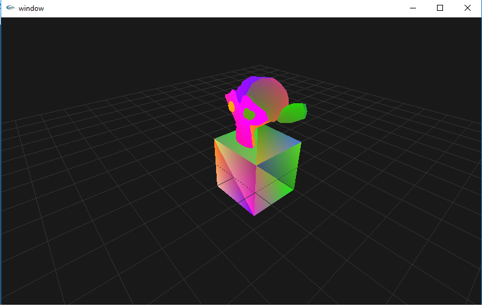  

7. tu_07_basic_shading : basic shading with light and normals  
基本着色演示。  
orginal tutorial => http://www.opengl-tutorial.org/cn/beginners-tutorials/tutorial-8-basic-shading/ 
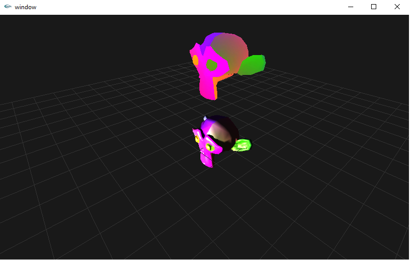  

8. tu_08_transparency : transparency  
演示透明的功能
orginal tutorial => http://www.opengl-tutorial.org/cn/intermediate-tutorials/tutorial-10-transparency/  
  
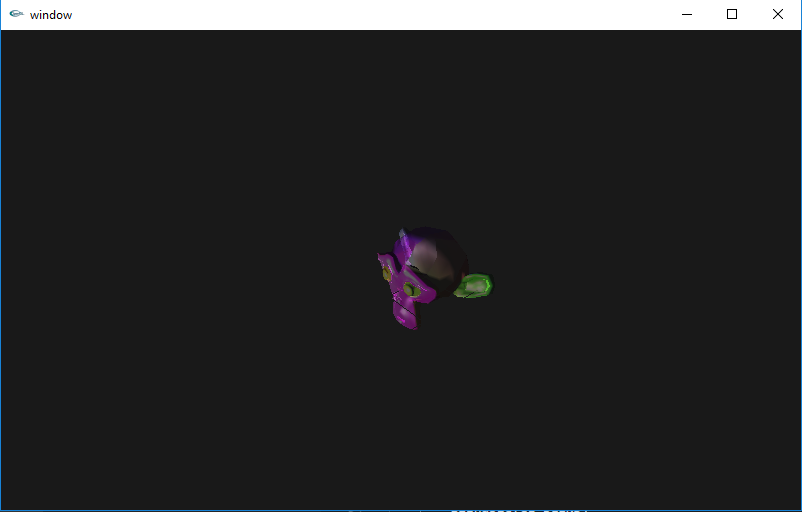

9. tu_09_draw_text: Draw text in openGL  
在OpenGL中绘制文本。  
orginal tutorial => http://www.opengl-tutorial.org/cn/intermediate-tutorials/tutorial-11-2d-text/  
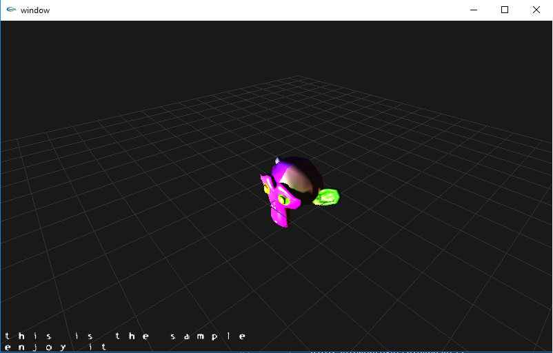  

10. tu_10_normal_mapping : Normal Mapping  
法线贴图的例子  
orginal tutorial =>  http://www.opengl-tutorial.org/cn/intermediate-tutorials/tutorial-13-normal-mapping/  
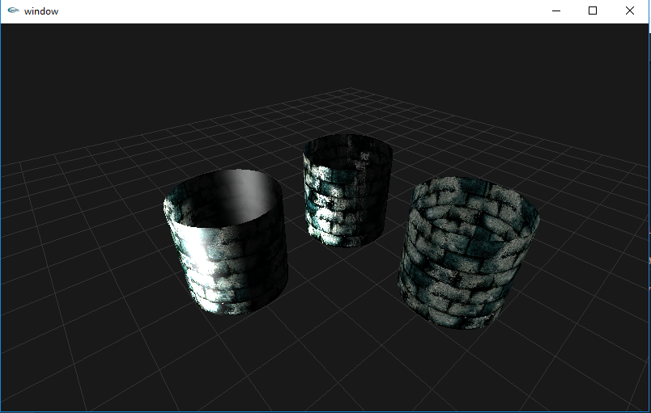  

